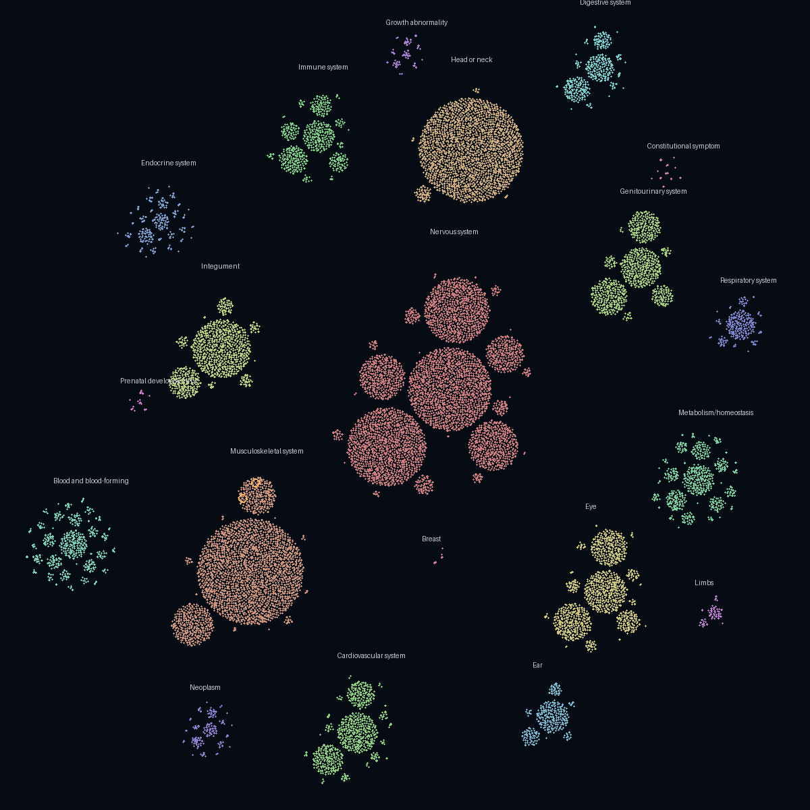
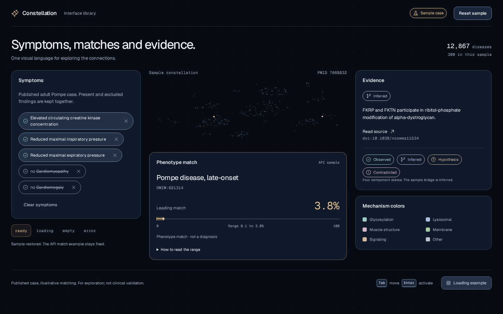

# Constellation

**From scattered symptoms to the community already working on them.**

A clinician dictates a case. Constellation maps the words to HPO phenotypes, scores all 12,867 rare diseases with explainable likelihood ratios, and dims a map of the rare-disease universe until a few candidates remain. It then shows how those diseases connect, with a source and an honest evidence level for every link, and ends with a concrete next step for this week: a test to ask for, a registry to join, an organisation to contact.

Built for Challenge 05 of the 7th Global AI Hackathon (Hack-Nation × OpenAI).

> Phenotype match, not a diagnosis or a clinical probability. Built only on published cases and public data.



*Real layout from `data/build.py`: one galaxy per HPO organ system, clusters by subsystem. Amber rings: late-onset Pompe disease (OMIM:621314) and FKRP-related LGMD R9 (ORPHA:34515), the demo case.*



## Why

- Rare-disease diagnosis takes **4.7 years on average**; 56% of people wait more than 6 months from the first consultation (EURORDIS Rare Barometer, 6,507 respondents, 41 countries, [Eur J Hum Genet 2024](https://www.nature.com/articles/s41431-024-01604-z)).
- Late-onset Pompe disease is found among patients labelled with unclassified limb-girdle muscular dystrophy, and a dried-blood-spot test is recommended in that situation ([Mol Genet Metab](https://www.sciencedirect.com/science/article/abs/pii/S1096719213002734), [Neuromuscul Disord](https://www.sciencedirect.com/science/article/abs/pii/S0960896615001339)).
- For FKRP-related LGMD R9 there is no approved therapy today; ribitol (BBP-418) has an NDA under priority review with a PDUFA date of 27 Nov 2026 ([BridgeBio](https://investor.bridgebio.com/news/news-details/2026/BridgeBio-Announces-FDA-Acceptance-and-Priority-Review-of-NDA-for-BBP-418-for-LGMD2IR9/default.aspx)).

## The flow

1. **Dictate** (EN or ES). `gpt-live-transcribe` streams the transcript to the browser.
2. **Extract.** A local HPO synonym search proposes candidate terms; `gpt-6-luna` picks among them with structured output, including negations ("no cardiomyopathy").
3. **Score.** Phenotype likelihood ratios over HPO v2026-09-01, aware of the HPO hierarchy. Every disease is scored, with a sensitivity range and the top drivers.
4. **Ask.** The next best question is the unasked phenotype with the most information gain between the top candidates.
5. **Inspect.** Every edge in the curated deep layer carries a source URL, a record ID, a retrieval date and an evidence level: observed, inferred, hypothesis or contradictory.
6. **Act.** Patient groups, registries, natural-history studies and trials (ClinicalTrials.gov API v2, NIH RePORTER), and a step for this week.

Architecture and data flow: [docs/ARCHITECTURE.md](docs/ARCHITECTURE.md).

## Run it

Requirements: Python 3.12 with [uv](https://docs.astral.sh/uv/), Node 20.19+ and Git.

```bash
uv sync
npm --prefix web ci
npm --prefix web run build
uv run uvicorn app.main:app --port 8000    # open http://127.0.0.1:8000
```

For development, run `uv run uvicorn app.main:app --reload --port 8000` and `npm --prefix web run dev` (port 5173, proxies `/api`; set `API_PORT` if 8000 is taken).

Optional `.env` (never committed):

```bash
OPENAI_API_KEY=sk-...   # live dictation, extraction and explanations
DEMO_MODE=true          # use recorded real responses instead of calling OpenAI
```

Without a key, or with `DEMO_MODE=true`, every AI step falls back to recorded real responses for the demo case, labelled `demo_data: true`. Scoring is always local.

Tests: `uv run pytest` and `bash scripts/smoke` (lint, tests and web build; it must print `PRODUCT_PASS`).

## Reproduce the data

Nothing in `app/fixtures/` is hand-edited except the curated deep layer, and every curated edge cites its source.

```bash
bash data/fetch.sh                  # HPO v2026-09-01: hp.json + phenotype.hpoa → data/raw/ (not committed)
python3 data/build.py               # → app/fixtures/graph/overview.json (layout) + annotations.json (frequencies, ancestors, background, labels, synonyms)
python3 data/build.py --check       # validates, and checks the build is byte-for-byte reproducible

python3 data/curate/build.py --refresh   # deep layer: curated.json + ClinicalTrials.gov API v2 + NIH RePORTER → app/fixtures/deep/deep.json
uv run python data/curate/check.py      # no edge without source_url and evidence_level; validates against app/schemas

uv run python app/fixtures/api/generate.py --download   # sample API responses, recomputed from the pinned inputs
```

Details: [data/README.md](data/README.md) and [data/curate/README.md](data/curate/README.md).

## How OpenAI is used

| Step | Model | Guardrail |
|---|---|---|
| Live dictation | `gpt-live-transcribe` (Realtime) with medical `keywords` | The browser gets a 10-minute ephemeral token from `POST /api/transcribe/session`; the API key never leaves the server |
| Symptoms → HPO | `gpt-6-luna`, JSON Schema `strict` | `hpo_id` is an `enum` of candidates from the local search; unknown or repeated IDs are dropped |
| Explanation for families | `gpt-6.1-sol` | May cite only the edges it receives as `[edge_id]`; the backend removes any other citation |

**The model never produces a number.** Percentages, ranges and the next question come from the likelihood-ratio computation and are reproducible. Spike results (models, latencies, failures): [spikes/openai/RESULT.md](spikes/openai/RESULT.md).

## Ethics and limits

- Only published cases (phenopacket-store) and public data; no patient data.
- A permanent notice that this is a phenotype match, not a diagnosis.
- Preclinical evidence is never presented as clinical. Ribitol has clinical evidence only for FKRP; the CRPPA link is inferred from a mouse study, and the FKTN link is an untested hypothesis.
- No treatment recommendations: the step is always to ask, test or contact.
- Same gene, different picture: FKRP causes both mild LGMD R9 and severe congenital muscular dystrophy, so nodes are never merged just because they share a gene.
- Percentages are relative matches among 12,867 diseases under a uniform prior; the range is a frequency-sensitivity envelope, not a calibrated confidence interval.

## Sources and licences

| Source | Use | Licence or terms |
|---|---|---|
| [Human Phenotype Ontology](http://obofoundry.org/ontology/hp.html) v2026-09-01 (`hp.json`, `phenotype.hpoa`, `genes_to_disease.txt`) | Phenotypes, annotations, genes | Free to use; the HPO Consortium must be acknowledged and cited |
| Orphanet annotations within HPO | Disease phenotypes | [Orphadata](https://www.orphadata.com/legal-notice/), CC BY 4.0 |
| [phenopacket-store](https://github.com/monarch-initiative/phenopacket-store) 0.1.27 | Demo case (GAA cohort, PMID:7668832) | BSD-3-Clause |
| [ClinicalTrials.gov API v2](https://clinicaltrials.gov/data-api/api) | Registries, studies, trials | Public U.S. government data |
| [NIH RePORTER API](https://api.reporter.nih.gov/) | Funded research | Public U.S. government data |
| Curated literature (Nat Commun, PMC, OMIM, ScienceDirect abstracts) | Deep-layer edges | Cited per edge in `app/fixtures/deep/deep.json` |
| [cosmos.gl](https://github.com/cosmosgl/graph), sigma.js, graphology | Graph rendering | MIT (`@cosmograph/cosmos` is CC BY-NC 4.0, used non-commercially) |

We acknowledge the Human Phenotype Ontology Consortium: Köhler S. et al., *The Human Phenotype Ontology in 2021*, [Nucleic Acids Research 49(D1):D1207](https://academic.oup.com/nar/article/49/D1/D1207/6017351).

## Team workflow

Four people with one or two AI agents each worked in parallel through a shared coordination protocol (claims, reviews, messages between agents). See [docs/AGENT-TOOLKIT.md](docs/AGENT-TOOLKIT.md).
